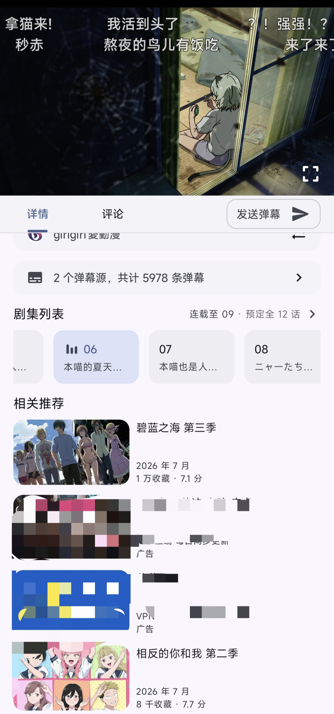
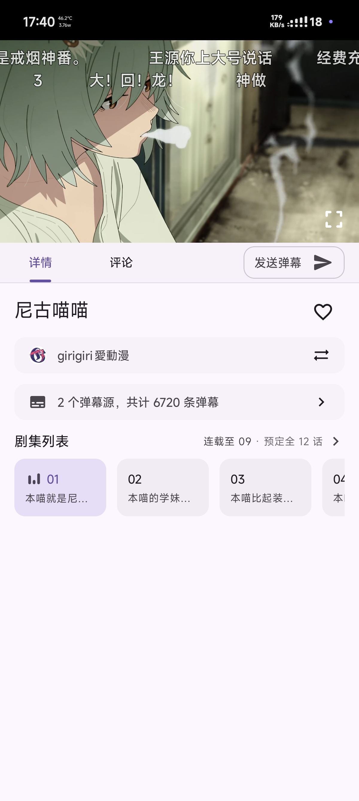

# Animeko 去"相关推荐"模块一键工具

> 🛠️ 自动去除 Animeko 应用内的"相关推荐"模块（连带其中广告），支持一键处理新版 APK。

## ✨ 功能特性

- 🔍 **智能定位**：通过唯一字符串锚点 `subject_recommendation_header` 自动定位目标渲染方法，不依赖易变的 lambda 编号
- 🎯 **精准移除**：将目标方法替换为空壳（直接返回），干净利落地移除整个推荐模块
- 🔄 **新版本兼容**：无论方法编号如何变化，只要锚点字符串存在即可可靠命中
- 📦 **一键处理**：提供 Bash 一键入口 + Python 核心脚本，支持后续版本平滑升级
- 🛡️ **签名复用**：复用同一 keystore，保证不同版本间可平滑覆盖安装，不丢失数据

## 🤖 AI 协助开发

本项目由 **AI 助手（小黑）** 协助开发完成。所有核心逻辑（包括锚点定位策略、反编译流程、`--api 35` 汇编修复等）均由 AI 协作完成，人类负责需求提出与最终验证。

## 📸 效果预览

原始界面（去除前，包含"相关推荐"和广告）：



去除后（干净的界面，不再显示"相关推荐"）：



## 📥 安装

### 依赖环境

| 工具      | 说明                                        |
|-----------|---------------------------------------------|
| python3   | 运行脚本                                    |
| baksmali  | 反编译 dex，需在 PATH 中                    |
| smali     | 汇编 dex，需在 PATH 中                      |
| zipalign  | 对齐 resources.arsc（Android 30+ 必需）     |
| apksigner | APK 签名工具                                |
| keystore  | 签名密钥（自行准备）                        |

### 下载

```bash
git clone https://github.com/liang2301266794/animeko-tool.git
cd animeko-tool
chmod +x animeko_patch.sh
```

## 🚀 使用方法

### 方式一：一键 Bash 入口（推荐）

```bash
./animeko_patch.sh /路径/新版Animeko.apk
# 或指定输出路径
./animeko_patch.sh /路径/新版Animeko.apk /tmp/result.apk
# 可通过环境变量覆盖签名 key 与 API 级别
KS=/path/to/key.jks KS_ALIAS=myalias KS_PASS=xxx ./animeko_patch.sh ...
```

### 方式二：直接调用 Python 脚本

```bash
python3 remove_recommend.py 输入.apk [--out 输出.apk] [--api 35]
```

### 完整示例（6.1.0 实测）

```bash
python3 remove_recommend.py /path/to/Animeko.apk --out /path/to/Animeko_norecommend.apk --api 35
```

> ⚠️ **务必加 `--api 35`！**
>
> 不加会因 smali 默认 API 级别过低（默认 15），导致重汇编后 `HasBackgroundScope` 等接口的
> `default` 方法标志丢失，应用一进主界面就闪退
> （`IncompatibleClassChangeError: Found interface ... but class was expected`）。
> 用 `--api 35` 可正确保留接口 default 方法（需 API 24+）。

## 🔧 工作原理

"相关推荐"广告实际混在整个推荐模块里，无法单独只删广告，因此本工具**移除整个模块的渲染**。

1. **枚举** APK 内所有 `classes*.dex`
2. **反编译** 逐个用 `baksmali` 处理
3. **定位** 搜索锚点字符串 `subject_recommendation_header` → 定位目标文件与方法
4. **替换** 将目标方法整体替换为空壳（直接返回）
5. **汇编** 用 `smali` 重新汇编（**必须带 `--api 35`**）
6. **重组** 用 `zipfile` 替换回 APK（保留各条目原压缩方式，避免破坏资源布局）
7. **对齐** 用 `zipalign` 对齐（`-p -f 4`，Android 30+ 要求 resources.arsc 未压缩且 4 字节对齐）
8. **签名** 用 `apksigner` 签名 + 验证

## 📁 目录结构

```
animeko-tool/
├── remove_recommend.py   # 核心自动化脚本
├── animeko_patch.sh      # 一键 Bash 入口
├── .gitignore            # Git 忽略规则
├── screenshots/          # 效果对比截图
│   ├── before.jpg        # 去除前（含相关推荐）
│   └── after.jpg         # 去除后（干净界面）
└── README.md             # 本说明
```

## ⚠️ 注意事项

- **签名密钥请妥善备份**，不要上传到 GitHub！新版本需要复用同一密钥才能平滑覆盖安装
- 首次从"原版签名"切换到本工具的 key 时，需先卸载原版应用
- 若新版 APK 改动了锚点字符串，工具会提示"未找到锚点"，届时需人工核对新版逻辑
- 反编译较大 dex 耗时较长属正常现象，请耐心等待
- 安装 APK 时若遇到 SELinux 权限问题，先将 APK 复制到 `/data/local/tmp/` 再执行 `pm install -r`

## 📄 许可

本项目仅供学习与个人使用，请遵守相关法律法规与软件许可协议。